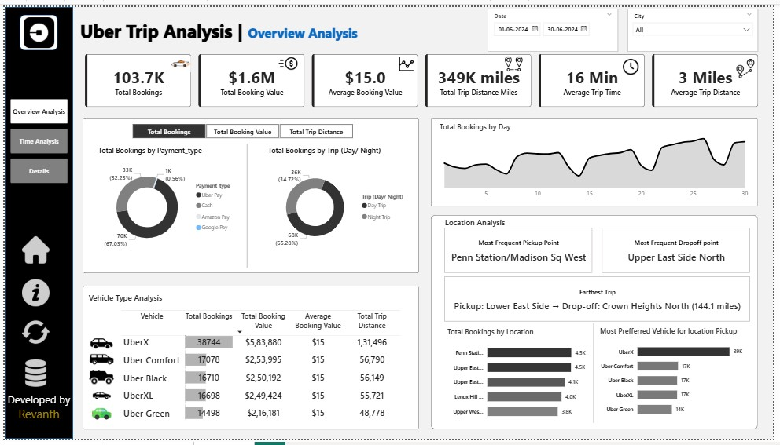

# Uber Trip Analysis Dashboard

## Overview

The **Uber Trip Analysis** dashboard provides a detailed and interactive visualization of Uber's trip data. Key insights such as total bookings, booking values, average trip times, and distances are visualized effectively. This dashboard helps Uber's business analysts and operations teams monitor and optimize ride-sharing patterns and trip efficiencies across different cities and regions.

## Key Features

- **Total Bookings and Revenue**: Displays the total bookings and total revenue generated from Uber trips.
- **Payment Type Breakdown**: Shows the breakdown of bookings based on different payment types, such as Uber Pay, Cash, Google Pay, and Amazon Pay.
- **Time and Trip Analysis**: Offers insights into total trip distance, average trip time, and a breakdown of bookings during the day and night.
- **Vehicle Type Performance**: Analyzes the performance of various vehicle types (UberX, Uber Comfort, Uber Black, UberXL, Uber Green) based on bookings, revenue, and trip distance.
- **Location-Based Insights**: Shows the most frequent pickup and drop-off locations, giving valuable data about high-demand areas.
- **Farther Trip Details**: Displays the longest trip recorded with its pickup and drop-off locations.

## Interact with the Dashboard
- Explore the various sections, such as Booking Insights, Vehicle Analysis, and Location Analysis.

- Use filters to customize the data by date, city, or vehicle type.

- View key metrics like total bookings, revenue, and average trip data at a glance.
  
## Technologies Used
- ** Data Visualization**: Advanced visualization libraries (e.g., Plotly, Matplotlib) for data representation
- ** Data Analysis**: Pandas for processing trip data and generating insights
- ** Tools Used**: Power Bi, Excel
## Conclusion
The Uber Trip Analysis Dashboard provides valuable insights into Uber’s trip data through interactive visualizations. It helps businesses optimize operations by analyzing key metrics like bookings, revenue, and vehicle performance. This tool empowers data-driven decision-making and enhances operational efficiency.
